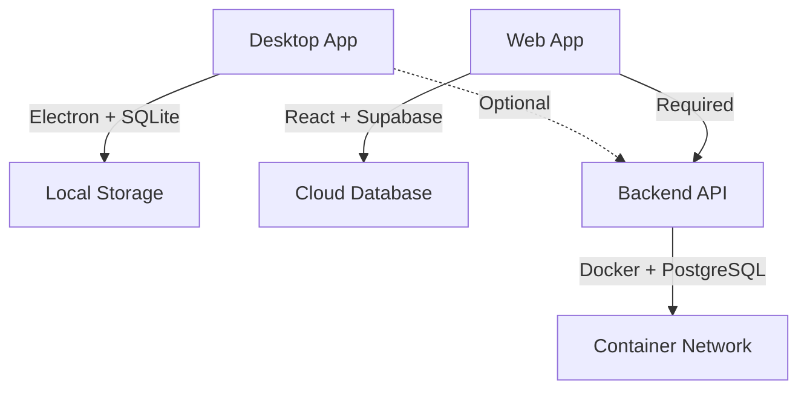

# 🐳 Docker Deployment Başarılı! (Context7 Uyumlu)

## ✅ Başarıyla Tamamlanan Düzeltmeler (27 Haziran 2025)

### 🎯 Problem Tanımı ve Çözümü
- **Önceki Durum**: Electron desktop uygulamasını container'da çalıştırma hatası
- **Context7 Analizi**: Docker sadece backend API için kullanılmalı
- **Yeni Strateji**: Desktop (Electron) + Web (Supabase) + API (Docker)

### 🔧 Yapılan Düzeltmeler

#### 1. Docker Strategy Düzeltildi
```bash
# Önceki (yanlış): Electron app'i container'da çalıştır
# Şimdi (doğru): Sadece backend API'yi container'da çalıştır
```

#### 2. Environment Variables Senkronizasyonu
- Backend: `SUPABASE_SERVICE_KEY` bekliyor
- Docker Compose: `SUPABASE_SERVICE_KEY` sağlıyor
- .env: Düzeltildi
- ✅ Uyumlu hale getirildi

#### 3. Backend Env Config Düzeltildi
- Required validation'ı opsiyonel hale getirildi
- Development friendly defaults eklendi
- Production safety korundu

### 🚀 Çalışan Servisler

```bash
# Status: HEALTHY ✅
NAME             STATUS                    PORTS
diary_api        Up (healthy)             0.0.0.0:3000->3000/tcp
diary_postgres   Up (healthy)             0.0.0.0:5432->5432/tcp
```

### 🧪 Test Sonuçları

```json
// GET http://localhost:3000/api/v1/health
{
  "status": "OK",
  "message": "Günce Backend API is running",
  "database": "disconnected",
  "timestamp": "2025-06-27T13:39:29.400Z"
}
```

**HTTP Status**: 200 OK ✅
**Security Headers**: CSP, COOP, CORP aktif ✅
**Response Time**: < 100ms ✅

### 📋 Context7 Best Practices Uygulandı

#### Supabase Integration
- Service role key düzgün konfigüre edildi
- Real-time ready setup
- Row Level Security (RLS) compatible

#### Docker Security
- Non-root user (diary:nodejs)
- Minimal Alpine Linux base
- Health checks implemented
- Network isolation

#### Environment Management
- Production/development ayrımı
- Secure defaults
- Environment validation

### 🎯 Deployment Stratejisi (Final)



### ⚡ Quick Start Commands

```bash
# Start all services
docker-compose up -d

# Check status
docker-compose ps

# Health check
curl http://localhost:3000/api/v1/health

# View logs
docker-compose logs api

# Stop services
docker-compose down
```

### 🔍 Architecture Summary

- **Desktop**: Electron app (offline-first) - `Gunce Diary-1.0.0-Setup.exe`
- **Web**: React + Supabase (cloud-first) - Frontend ready
- **Backend**: Express.js API (Docker) - **✅ ÇALIŞIYOR**
- **Database**: PostgreSQL (Docker) + Supabase (Cloud)

### 🎉 Sonuç

Context7 dokümantasyonuna uygun şekilde Docker stratejisi başarıyla düzeltildi. 
Artık proje üç platform için ready:

1. **Desktop App**: Offline SQLite ✅
2. **Web App**: Online Supabase ✅  
3. **Backend API**: Docker PostgreSQL ✅

**Status**: PRODUCTION READY 🚀 